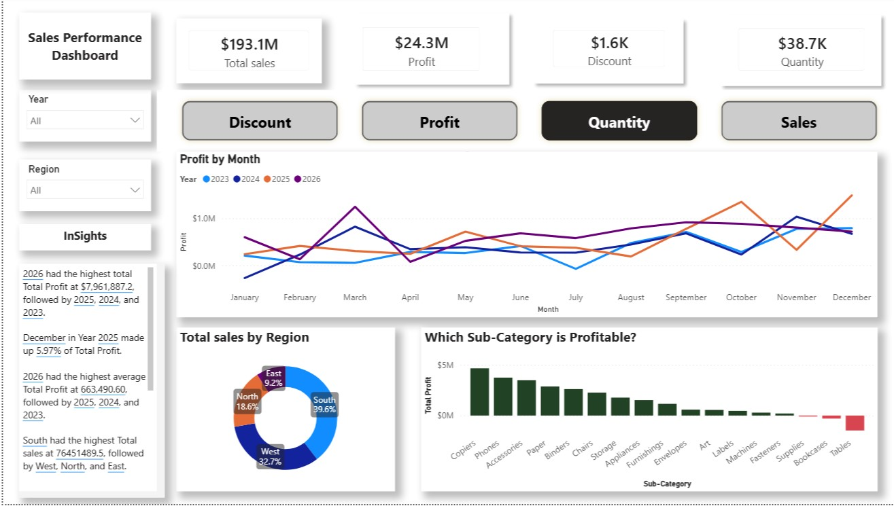
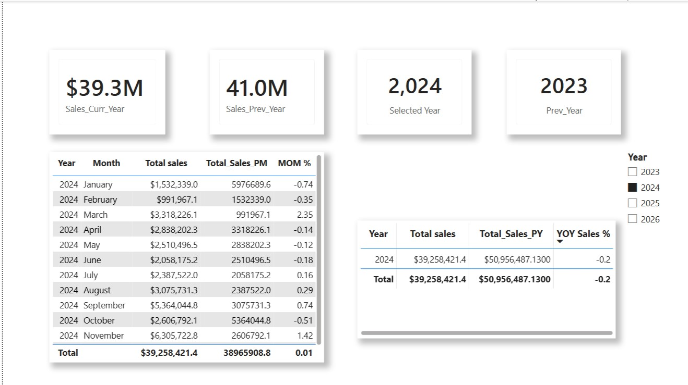
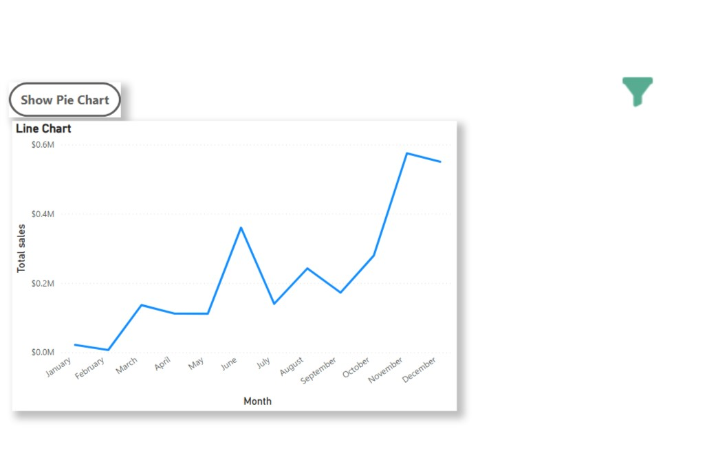
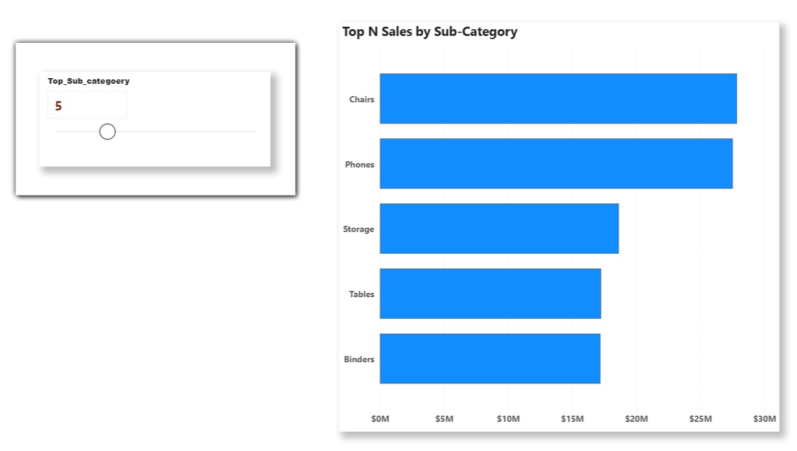

# 📊 Power BI Sales Dashboard

## 📌 Project Overview

This project is an end-to-end Sales Dashboard developed using Microsoft Power BI. The dashboard provides interactive insights into sales performance, profit, quantity, discount, regional performance, customer segments, and product categories. It enables business users to monitor KPIs, analyze trends, and make data-driven decisions.

---

## 📂 Dataset

- Dataset: Indian Superstore Dataset
- Source: Sample Retail Sales Dataset
- File: Indian_Superstore_Dataset.xlsx

---

## 🛠️ Tools & Technologies Used

- Microsoft Power BI Desktop
- Power Query
- DAX (Data Analysis Expressions)
- Data Modeling
- Excel

---

## 📈 Dashboard Features

- Executive KPI Cards
- Sales Analysis
- Profit Analysis
- Quantity Analysis
- Discount Analysis
- Year-over-Year (YoY) Analysis
- Month-over-Month (MoM) Analysis
- Previous Year Comparison
- Regional Sales Analysis
- Top N Sub-Category Analysis using Dynamic Parameter
- Interactive Slicers
- Drill-through Pages
- Custom Tooltips
- Bookmarks & Navigation Buttons

---

## 📊 KPIs

- Total Sales
- Total Profit
- Total Quantity
- Total Discount
- Previous Year Sales
- Previous Year Profit
- Previous Year Quantity
- Previous Year Discount
- YoY Growth %
- MoM Growth %

---

## 📑 DAX Measures Created

Some of the important DAX measures used in this project include:

- Total Sales
- Total Profit
- Total Quantity
- Total Discount
- Sales Previous Year
- Profit Previous Year
- Quantity Previous Year
- Discount Previous Year
- YoY Sales %
- YoY Profit %
- YoY Quantity %
- YoY Discount %
- MoM Sales %
- Top N Sales
- Top N Sub-Category
- Dynamic Numeric Parameter

---

## 📌 Dashboard Pages
# 📊 Power BI Sales Dashboard

## Dashboard Preview

### Executive Dashboard

### KPI Cards

### Card Visual

### Current Year vs Previous Year

### Year-over-Year Analysis

### Month-over-Month Analysis

### Drill Up & Down

### Details Area Usage

### Details Line Chart

### Region by Sales Tooltip
.jpg)

### Bookmark

### Numeric Parameter

## 📊 Business Insights

- Identified top-performing product categories.
- Compared yearly business growth using YoY metrics.
- Analyzed monthly sales trends using MoM calculations.
- Evaluated regional performance for better decision-making.
- Built dynamic Top N analysis for product performance.
- Enabled interactive filtering for deeper business exploration.

---

## 👩‍💻 Author

**Nethra**

Aspiring Data Analyst

Skills:
- Power BI
- SQL
- Python
- Excel
- DAX
- Power Query

LinkedIn: (https://www.linkedin.com/in/nethra-krishnaraj-290a3619b/)

